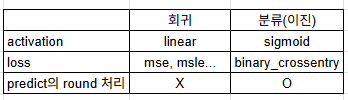
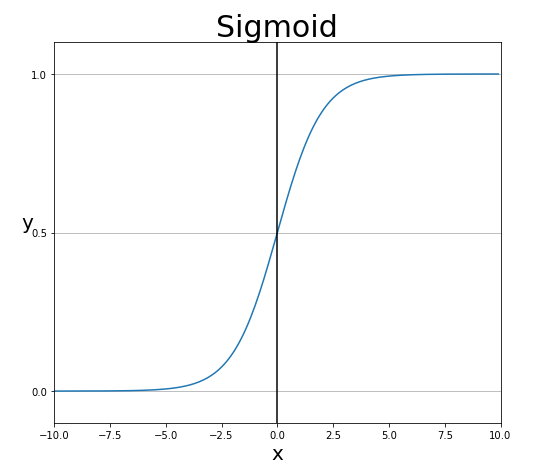

# 2026.09.08 복습 — EarlyStopping 튜닝 · Local/Global Minima · 이진분류(sigmoid)

> 오늘 흐름: EarlyStopping을 여러 회귀 데이터셋에 적용해 튜닝(회귀 마무리) → 회귀에서 **분류** 모델로 전환 → 이진분류 실습(유방암) → 캐글 이진분류 대회 제출(산탄데르).

---

## 1. keras20_early_stopping2 ~ 5 — EarlyStopping 튜닝 실습

앞서 배운 EarlyStopping을 회귀 데이터셋들(diabetes, boston, 따릉이, 캐글 자전거)에 각각 적용해 최적 설정을 찾는 실습이다.

```python
es = EarlyStopping(
    monitor='val_loss', mode='min',
    patience=..., restore_best_weights=True,
)
model.fit(..., epochs=..., callbacks=[es])
```
- 데이터셋마다 `patience`, `epochs`, 층 구성 등을 조정하며 val_loss가 최소가 되는 지점을 찾는다.
- 회귀 모델은 기본적으로 여기까지가 한 바퀴다(선형회귀 → 딥러닝 → 실전 데이터 → validation → EarlyStopping).

### Local Minima와 Global Minima
- 학습은 loss가 낮아지는 방향으로 가중치를 조정하며 **가장 낮은 지점(최소값)** 을 찾는 과정이다.
- **Global Minima(전역 최소)**: loss가 진짜로 가장 낮은 지점. 학습이 도달하려는 최종 목표.
- **Local Minima(지역 최소)**: 주변보다는 낮지만 전역 최소는 아닌, 움푹 들어간 지점. 학습이 여기에 갇히면 더 좋은 지점(전역 최소)으로 못 나아갈 수 있다.
- 최적화의 관건은 지역 최소에 갇히지 않고 전역 최소에 가깝게 도달하는 것이다.

---

## 2. 회귀 → 분류 모델로 전환

지금까지의 회귀는 **수치**를 예측했다. **분류(classification)** 는 값이 딱 떨어지는 **정해진 범주**를 예측한다. (예: 남자인지 여자인지, 양성인지 음성인지.)

- **분류는 라벨(정답)의 종류가 미리 정해져 있어야 한다.**
- 분류는 두 종류로 나뉜다:
  - **이진분류(이중분류)**: 범주가 2개 (0 또는 1).
  - **다중분류**: 범주가 3개 이상.

### 회귀와 분류(이진)의 차이



| 구분 | 회귀 | 분류(이진) |
|---|---|---|
| 출력층 activation | linear(지정 안 함) | **sigmoid** |
| loss | mse, rmse 등 | **binary_crossentropy** |
| predict의 round 처리 | 필요 없음(X) | **필요함(O)** |

이 세 가지가 회귀 코드를 이진분류 코드로 바꿀 때 달라지는 핵심이다.

---

## 3. keras21_sigmoid_metrics_cancer — 이진분류 실습(유방암)

### 데이터 불러오기와 확인
```python
from sklearn.datasets import load_breast_cancer
datasets = load_breast_cancer()          # 유방암 관련 데이터

print(datasets.DESCR)                     # 데이터 내역 명세(설명)
print(datasets.feature_names)             # 피처(열) 이름 전부

x = datasets["data"]     # datasets.data 와 동일. 딕셔너리 형태라 ["키"]로도 접근 가능
y = datasets.target
print(x.shape, y.shape)  # (569, 30) (569,)  → 569행 30열
print(type(x))           # <class 'numpy.ndarray'>
```
- **`type()`**: 데이터가 어떤 형태(자료형)인지 보여주는 함수. 여기서 x는 numpy 배열이다.
- 내장 데이터셋은 딕셔너리 형태라 `datasets.data`와 `datasets["data"]` 둘 다로 접근할 수 있다.
- pandas 자체도 내부적으로 numpy로 구성되어 있다.

### 클래스(라벨) 개수 세기
분류에서는 각 범주가 몇 개씩 있는지 파악하는 것이 중요하다.
```python
# numpy 방식
print(np.unique(y))                        # [0 1]  → 어떤 범주가 있는지(중복 제거)
print(np.unique(y, return_counts=True))    # (array([0, 1]), array([212, 357]))  → 0이 212개, 1이 357개

# pandas 방식 (같은 결과)
print(pd.DataFrame(y).value_counts())
print(pd.Series(y).value_counts())
```
- **`np.unique(y)`**: 값의 종류만(중복 제거) 출력 → 어떤 범주가 있는지.
- **`np.unique(y, return_counts=True)`**: 종류와 함께 각 범주의 개수까지 출력.
- **`value_counts()`**: pandas에서 각 값의 개수를 센다. numpy·pandas 중 편한 것을 쓰면 된다.

### stratify — 라벨 비율을 유지하며 분할
```python
x_train, x_test, y_train, y_test = train_test_split(
    x, y, train_size=0.7, random_state=32,
    stratify=y,   # 라벨 비율에 맞춰 나눔
)
```
- **`stratify=y`**: 분류 데이터를 나눌 때 **원래 라벨 비율을 train/test 양쪽에 그대로 유지**하며 나눈다.
- 예를 들어 0이 212개, 1이 357개인 비율을, 나눈 뒤에도 train과 test가 각각 비슷한 비율을 갖도록 한다. 한쪽에 특정 라벨이 몰리는 것을 막아 분류 모델을 안정적으로 학습시킨다.

### 모델 구성 — 출력층 sigmoid
```python
model.add(Dense(64, activation='relu', input_dim=30))
...
model.add(Dense(1, activation='sigmoid'))   # 이진분류의 출력층
```
- 히든층은 relu를 쓰고, **출력층에는 `sigmoid`** 를 쓴다. 이진분류의 출력층은 sigmoid로 고정이다.



- **sigmoid**: 입력이 아무리 크거나 작아도 출력을 **0과 1 사이 값으로 한정(제한)** 하는 활성화 함수다(로지스틱 함수라고도 한다). 그래프가 S자 모양이며, 입력 0에서 출력 0.5를 지난다.
- 출력이 0~1이라 **"1일 확률"** 처럼 해석할 수 있고, 이후 0.5를 기준으로 0 또는 1로 판정한다.

### 컴파일 — binary_crossentropy, metrics
```python
model.compile(loss='binary_crossentropy', optimizer='adam',
              metrics=['acc'])   # metrics=['accuracy'] 와 동일
```
- **`loss='binary_crossentropy'`**: 이진분류 전용 손실 함수. (회귀의 mse 자리에 해당하며, 이진분류에서는 이것으로 고정.)
- **`metrics`**: 훈련·평가 중 함께 볼 **보조지표**. 분류에서는 정확도(accuracy)를 넣는다. `['accuracy']`와 `['acc']`는 같다.
- metrics는 loss와 달리 학습(가중치 갱신)에 직접 쓰이지 않는 참고용 지표다. metrics를 넣으면 `evaluate`가 `[loss, accuracy]` 형태의 리스트를 반환한다.

### 평가·예측 — evaluate 반환값과 predict round
```python
loss = model.evaluate(x_test, y_test)
print('loss = ', loss[0])            # 손실
print('acc = ', round(loss[1], 4))   # 정확도
```
- metrics를 지정했으므로 `evaluate`의 반환값은 리스트다: `loss[0]`은 손실, `loss[1]`은 정확도.

```python
y_pred = model.predict(x_test)   # sigmoid 출력이라 0~1 사이 확률값
y_pred = np.round(y_pred)        # 0.5 기준으로 0 또는 1로 변환

from sklearn.metrics import accuracy_score
acc_score = accuracy_score(y_test, y_pred)
```
- **`predict`의 출력은 0~1 사이 연속값(확률)** 이다.
- `accuracy_score`는 실제 라벨(0/1)과 예측을 비교하는데, 예측이 0.7 같은 연속값이면 "이진값과 연속값을 섞을 수 없다"는 에러가 난다.
- 그래서 **`np.round`로 0.5 기준 반올림**해 0 또는 1로 만든 뒤 비교한다. 이것이 회귀와 달리 분류에서 **predict에 round 처리가 필요한** 이유다.

---

## 4. keras22_sigmoid_santander — 캐글 이진분류 대회 제출

캐글 "Santander Customer Transaction Prediction" 대회 데이터로 이진분류 모델을 만들고 제출까지 한다.

```python
path = './_data/kaggle_santander/'
train_csv = pd.read_csv(path + "train.csv", index_col=0)
test_csv  = pd.read_csv(path + "test.csv", index_col=0)
submission_csv = pd.read_csv(path + "sample_submission.csv", index_col=0)

print(train_csv.shape)   # (200000, 201)
print(test_csv.shape)    # (200000, 200)
```
- **컬럼명이 비공개(익명화)** 된 데이터다(var_0, var_1 … 처럼 의미를 숨김). 그래서 각 컬럼의 뜻을 모른 채 수치만으로 학습한다.
- x, y 분리: `x = train_csv.drop(['target'], axis=1)`, `y = train_csv['target']`.
- 라벨 분포 확인: `np.unique(y, return_counts=True)` → 0이 179902개, 1이 20098개로 **불균형**하다. 이런 경우 `stratify=y`로 비율을 유지하며 나누는 것이 특히 중요하다.

모델 구성·컴파일은 유방암 실습과 동일한 이진분류 형태다(출력층 sigmoid, loss binary_crossentropy, metrics acc).

### 제출 파일 생성
```python
y_submit = model.predict(test_csv)
submission_csv['target'] = y_submit
submission_csv.to_csv(path + "submit/" + "submit_santander.csv")
```
- test를 예측해 제출 양식의 target 컬럼에 채우고 csv로 저장해 캐글에 제출한다.

---

## 5. 한눈에 보기 (파일별 recap)

| 파일 | 주제 | 핵심 |
|---|---|---|
| keras20_early_stopping2~5 | EarlyStopping 튜닝 | diabetes·boston·따릉이·자전거에 적용, Local/Global Minima |
| keras21_sigmoid_metrics_cancer | 이진분류 | sigmoid·binary_crossentropy·metrics, stratify, np.round |
| keras22_sigmoid_santander | 캐글 이진분류 제출 | 익명 컬럼·불균형 데이터, submission 생성 |

---

## 6. 오늘 한 줄 요약

> 회귀를 EarlyStopping까지 마무리하고 **분류**로 넘어간다. 분류는 정해진 범주를 예측하며, 이진분류는 회귀 대비 **출력층 sigmoid · loss binary_crossentropy · predict에 round 처리** 세 가지가 달라진다.
> 분류 데이터는 `stratify`로 라벨 비율을 유지하며 나누고, `metrics=['acc']`로 정확도를 함께 보며, sigmoid 출력(0~1 확률)은 `np.round`로 0/1로 바꿔 정확도를 계산한다.

---

## 7. 이미지·환경 메모

- 이 문서와 같은 폴더에 이미지 두 개를 둔다: `회귀_분류_차이.png`, `sigmoid_그래프.png`.
- 산탄데르 실습은 `_data/kaggle_santander/` 경로와 `submit/` 폴더가 필요하다.
