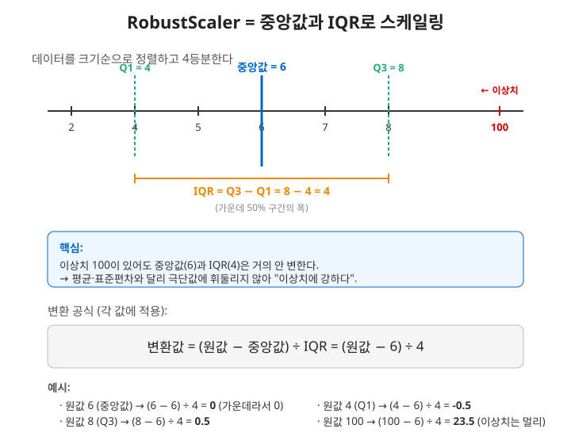

# 2026.09.11 복습 — 스케일러 MinMax + 3종(Standard·MaxAbs·Robust) (총 4종) 비교 · 모델 save/load

> 오늘 흐름: 어제의 MinMaxScaler에 이어 StandardScaler·MaxAbsScaler·RobustScaler를 다루고 네 종류를 비교한 뒤, 학습한 모델을 파일로 저장·불러오는 save/load를 배운다.

---

## 1. 스케일러 공통 원리

- **모든 스케일러는 컬럼(피처)별로 따로 적용된다.** 각 컬럼이 자기 컬럼의 통계값(최소·최대, 평균, 중앙값 등)을 기준으로 변환된다.
- 사용 패턴은 스케일러 종류와 무관하게 동일하다. **fit은 train에만, transform은 train·test 둘 다.**
```python
from sklearn.preprocessing import MinMaxScaler, StandardScaler, MaxAbsScaler, RobustScaler
scaler = StandardScaler()          # 종류만 바꾸면 됨 (사용법은 동일)

x_train = scaler.fit_transform(x_train)   # fit + transform을 한 줄로 (train)
x_test  = scaler.transform(x_test)        # test는 transform만 (fit 안 함)
```
- **`fit_transform`**: `fit(x_train)` 다음 `transform(x_train)`을 한 줄로 합친 단축 형태다. train에만 쓰고, test에는 `transform`만 쓴다.

---

## 2. StandardScaler — 평균 0 기준으로 표준화

### 식
$$ \text{변환값} = \frac{x - \text{평균}}{\text{표준편차}} $$

### 원리
- **(x − 평균)**: 각 값에서 그 컬럼의 평균을 뺀다. 평균이 0이 되도록 전체를 이동시키는 것이다. 값이 평균과 같으면 0, 평균보다 크면 양수, 작으면 음수가 된다. 즉 결과는 "평균에서 얼마나 떨어져 있는가"를 나타낸다.
- **/ 표준편차**: 그 값을 표준편차(데이터가 퍼진 정도)로 나눠, 퍼짐의 단위를 1로 통일한다.
- 결과: **평균 0, 표준편차 1**인 분포가 된다. 대부분의 값이 −3~3 사이에 들어온다.

### MinMax와의 차이
- MinMax는 **양 끝(최소·최대)** 을 0과 1로 맞춰 **0~1 범위로 가둔다.**
- Standard는 **가운데(평균)** 를 0으로 맞추고 퍼짐을 표준편차로 잰다. 범위가 고정되지 않고 **음수도 나온다.**
- StandardScaler는 0을 기준으로 값을 줄인다고 이해하면 된다.

---

## 3. MaxAbsScaler — 최대 절대값으로 나누기

### 원리
각 컬럼에서 **가장 큰 절대값**으로 모든 값을 나눈다.
```
데이터:            -100, -50, 0, 100, 200
최대 절대값:       |200| = 200
각 값 ÷ 200:       -0.5, -0.25, 0, 0.5, 1
```
- 결과는 **−1 ~ 1** 사이가 된다.
- 부호를 그대로 살리며(음수는 음수로), **0은 0으로 유지**된다.

---

## 4. RobustScaler — 이상치에 강한 스케일러

### 왜 필요한가
평균과 표준편차는 **이상치(극단값) 하나에 크게 흔들린다.** (MinMax가 이상치에 약했던 것과 같은 맥락이다.) RobustScaler는 이상치의 영향을 덜 받도록 만든 스케일러다.

### 원리
평균 대신 **중앙값(median)**, 표준편차 대신 **IQR(사분위 범위)** 를 쓴다.

$$ \text{변환값} = \frac{x - \text{중앙값}}{\text{IQR}} $$

- **중앙값**: 데이터를 크기순으로 정렬했을 때 정확히 가운데 값.
- **IQR(Interquartile Range, 사분위 범위)**: 데이터를 크기순으로 정렬해 4등분했을 때, **가운데 50% 구간의 폭**(Q3 − Q1).
- 중앙값과 IQR은 양 끝의 극단값에 거의 영향받지 않으므로, **이상치가 많은 데이터일수록 안정적인 스케일링**을 기대할 수 있다.



---

## 5. 스케일러 4종 비교

| 스케일러 | 기준값 | 식 | 결과 범위 | 특징 |
|---|---|---|---|---|
| MinMaxScaler | 최소·최대 | (x−min)/(max−min) | 0 ~ 1 | 이상치에 약함 |
| StandardScaler | 평균·표준편차 | (x−평균)/표준편차 | 제한 없음(평균 0, 표준편차 1) | 0 중심 표준화, 정규분포에 적합 |
| MaxAbsScaler | 최대 절대값 | x / \|max\| | −1 ~ 1 | 부호·0 유지 |
| RobustScaler | 중앙값·IQR | (x−중앙값)/IQR | 제한 없음 | 이상치에 강함 |

### 스케일러를 섞어 쓸 수 있는가
- 한 스케일러의 결과에 다른 스케일러를 이어서 적용할 수 있다(예: MinMax → Standard, 또는 그 반대).
- 결과는 좋을 수도 나쁠 수도 있어 돌려보고 판단하며, 섞어 쓴다고 특별히 좋아진다고 보기는 어렵다. 결국 **여러 스케일러 중 성능이 가장 잘 나오는 것을 선택**한다.

### 데이터셋별 적용 결과(참고)
epochs를 적게 준 실습 결과라 확정적이지 않다.
- **StandardScaler (MinMax와 비교)**: 대부분(california, diabetes, boston, kaggle_bike, cancer, santander, wine, covtype, digits) 비슷함 / ddarung 많이 좋아짐.
- **MaxAbsScaler (Standard와 비교)**: california, diabetes, santander, wine, covtype, digits 비슷함 / boston, ddarung, kaggle_bike, cancer 안 좋아짐.
- 스케일러 선택에 절대적 규칙은 없으며, 데이터마다 돌려서 비교해야 한다.

---

## 6. 모델 save / load — 모델을 파일로 저장·불러오기

```python
model.save(path + 'keras29_1_save_model.keras')          # 저장
from tensorflow.keras.models import load_model
model = load_model(path + 'keras29_1_save_model.keras')  # 불러오기
```
- **`model.save('경로.keras')`**: 현재 모델(구조 + 가중치 + 컴파일 정보)을 하나의 `.keras` 파일로 저장한다.
- **`load_model('경로.keras')`**: 저장된 모델을 통째로 불러온다.

### 핵심 — "언제 저장하느냐"가 저장되는 가중치를 결정한다
model.save는 **저장하는 그 순간의 가중치**를 함께 저장한다. 따라서 저장 시점이 중요하다.

**① 모델 구성 직후 저장 (keras29_1)**
```python
#2. 모델구성
model = Sequential(); model.add(...) ...
model.save(path + 'keras29_1_save_model.keras')   # 훈련 전에 저장
exit()   # 프로그램 즉시 종료 (훈련하지 않음)
```
- 훈련(fit) 전에 저장하므로, 저장된 가중치는 **아직 학습되지 않은 초기(랜덤) 값**이다.
- 이 모델을 불러오면(keras29_2) 가중치가 **epoch 0 상태**라, 원하는 결과를 얻으려면 **다시 훈련해야 한다.**

**② 훈련 후 저장 (keras29_3)**
```python
model = load_model(path + 'keras29_1_save_model.keras')   # 구조를 불러와서
model.compile(...); model.fit(...)                        # 훈련한 뒤
model.save(path + 'keras29_3_save_model.keras')           # 저장 → 훈련된 가중치 포함
```
- 훈련(fit) 후에 저장하므로 **학습된 가중치까지 저장**된다.
- 이 모델을 불러오면(keras29_4) 학습된 상태 그대로 사용할 수 있다.

### 정리 — 저장 목적에 따라 시점 선택
- **모델 구조만 재사용**하고 싶으면 → **모델 구성 직후**에 저장(keras29_1 방식). 불러온 뒤 훈련은 다시 한다.
- **훈련된 가중치까지 재사용**하고 싶으면 → **훈련(fit) 후**에 저장(keras29_3 방식). 불러오면 학습 결과가 그대로 유지된다.

---

## 7. 한눈에 보기 (파일별 recap)

| 파일 | 주제 | 핵심 |
|---|---|---|
| keras28_scaler01~10 | 스케일러 적용 | Standard·MaxAbs·Robust로 바꿔가며 비교 |
| keras29_1_save_model | 저장(구성 후) | 구조 + 초기 가중치 저장, exit()로 훈련 전 종료 |
| keras29_2_load_model | 불러오기 | 초기 가중치 상태 → 다시 훈련 필요 |
| keras29_3_save_model2 | 저장(훈련 후) | 훈련된 가중치까지 저장 |
| keras29_4_load_model2 | 불러오기 | 훈련된 모델을 불러와 사용 |

---

## 8. 오늘 한 줄 요약

> 스케일러는 종류(MinMax·Standard·MaxAbs·Robust)만 바꿔 같은 방식으로 쓰며(fit은 train, transform은 양쪽), 각각 기준이 다르다: **MinMax는 0~1, Standard는 평균 0 표준화, MaxAbs는 −1~1, Robust는 이상치에 강함.** 어느 것이 좋은지는 데이터마다 돌려서 비교한다.
> `model.save`/`load_model`로 모델을 저장·복원하며, **구성 직후 저장하면 구조(초기 가중치), 훈련 후 저장하면 학습된 가중치**가 담긴다.
