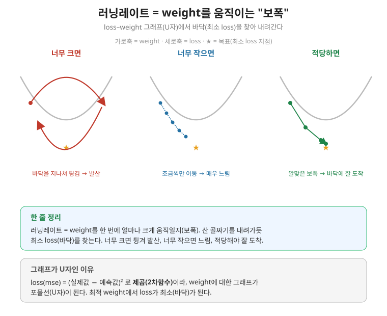

# 2026.09.22 복습 — 데이터 증폭 심화 · 한 클래스만 증폭 · 러닝레이트(learning rate)

> 오늘 흐름: 증폭의 원리(단순 복붙 vs 증강) → 여러 데이터셋에 증폭 적용 → 한 클래스(여자)만 골라 증폭하기 → 러닝레이트 이론.

---

## 1. keras50_flow2_next — 증폭의 원리 (단순 복붙 ≠ 증강)

### 단순 복붙은 왜 안 되나
```python
aaa = np.tile(x_train[0], augment_size).reshape(-1, 28, 28, 1)   # (100, 28, 28, 1)
```
- **`np.tile`**: 배열을 그대로 반복 복사한다. 이미지 한 장을 100번 복붙한 것.
- 그러나 이건 **똑같은 이미지가 100장**일 뿐이다. 데이터 개수만 늘고 내용이 같아서 **과적합**만 부른다. 실제 증폭에는 이대로 쓰지 않는다.

### 증강 — 복붙이 아니라 "변형"
같은 이미지를 datagen에 통과시키면, 뒤집기·회전 등이 적용된 **서로 다른 변형본**이 만들어진다.
```python
xy_data = datagen.flow(
    np.tile(x_train[0].reshape(28*28), augment_size).reshape(-1, 28, 28, 1),  # 한 장을 100개로
    np.zeros(augment_size),        # y는 형식상 필요(안 씀)
    batch_size=augment_size,       # 통배치(전부 한 번에)
    shuffle=False,
).next()                           # (파이썬 3.11+는 next(...))
```
- `flow`의 결과에 `.next()`를 붙이면 **`(x, y)` 튜플**이 나온다. 튜플이라 `.shape`가 없고, `len(xy_data)`는 2(x, y), `xy_data[0]`이 x, `xy_data[1]`이 y다.
- `plt.imshow`로 그려보면, 원본 한 장에서 조금씩 다르게 변형된 이미지 여러 장이 확인된다. 이것이 증강(단순 복붙과의 차이)이다.

---

## 2. keras51_augment1~4 — 증폭 기본 패턴

fashion·mnist·cifar10·cifar100의 성능을 데이터 증폭으로 올리는 실습이다. 공통 패턴:

```python
augment_size = 40000
randidx = np.random.randint(x_train.shape[0], size=augment_size)   # 전체 중 4만개 랜덤 인덱스
x_augmented = x_train[randidx].copy()      # 그 인덱스로 뽑아 복사
y_augmented = y_train[randidx].copy()

x_augmented = x_augmented.reshape(..., 1)  # (흑백만) 4차원으로. 컬러는 이미 4차원이라 생략
x_augmented = next(datagen.flow(x_augmented, y_augmented, batch_size=augment_size, shuffle=False))[0]  # 변형

x_train = np.concatenate((x_train, x_augmented))   # 원본 + 증강본 합치기
y_train = np.concatenate((y_train, y_augmented))
```
- **`np.random.randint`/`np.random.choice`**: 랜덤 인덱스를 뽑는다.
- **`.copy()`**: 원본과 분리된 **새 배열**을 만든다(원본을 건드리지 않기 위함).
- **`datagen.flow(...)`**: 뽑은 이미지들을 변형한다. `[0]`으로 x만 꺼낸다.
- **`np.concatenate`**: 원본과 증강본을 이어 붙인다(6만 + 4만 = 10만).
- 흑백(mnist·fashion)은 채널이 없어 `reshape(...,1)`로 붙이지만, 컬러(cifar)는 이미 `(N,32,32,3)`이라 reshape하지 않는다.

---

## 3. keras51_augment5_men_women — 한 클래스(여자)만 증폭 (처음~끝)

남녀 데이터에서 **여자 이미지만 골라 증폭**해 원본에 더하는 실습이다. 단계별로:

### ① npy 불러오기
```python
x_train = np.load(path + "men_women_x_train.npy")   # 이미 수치화·저장된 데이터
y_train = np.load(path + "men_women_y_train.npy")    # 라벨: men=0, women=1 (알파벳순)
...
```

### ② 여자만 골라내기 — np.where
```python
x_train_woman = x_train[np.where(y_train > 0.0)]   # (7591, 100, 100, 3)
y_train_woman = y_train[np.where(y_train > 0.0)]
```
- **`np.where(y_train > 0.0)`**: y가 0보다 큰(=1=여자) **위치(인덱스)** 를 찾는다.
- 그 인덱스로 `x_train`에서 **여자 이미지만** 추출한다. (men=0은 빠지고 women=1만 남음.)

### ③ train/test 나누기
```python
x_train, x_test, y_train, y_test = train_test_split(x_train, y_train, train_size=0.8, random_state=1024)
```

### ④ 증강 규칙(datagen) 만들기
```python
datagen = ImageDataGenerator(
    # rescale=1./255,      # npy가 이미 0~1로 저장돼 있으므로 다시 나누지 않음(주석 처리)
    horizontal_flip=True, width_shift_range=0.1, rotation_range=15, fill_mode='nearest',
)
```
- **rescale을 뺀 이유**: 불러온 npy가 저장 시 이미 스케일링된 상태라, 또 `/255`하면 **두 번 나눠져** 값이 망가진다.

### ⑤ 여자 중 랜덤 뽑기
```python
augment_size = 8000
randidx = np.random.choice(x_train_woman.shape[0], size=augment_size)   # 여자 중 8000개 랜덤 인덱스
x_augmented = x_train_woman[randidx].copy()
y_augmented = y_train_woman[randidx].copy()
```

### ⑥ 증강
```python
x_augmented = next(datagen.flow(x_augmented, y_augmented, batch_size=augment_size, shuffle=False))[0]
```
- 뽑은 여자 이미지 8000장을 변형한다. (men_women은 컬러 4차원이라 reshape 불필요.)

### ⑦ 원본에 붙이기
```python
x_train = np.concatenate((x_train, x_augmented))   # 원본 + 증강한 여자 8000
y_train = np.concatenate((y_train, y_augmented))   # (25386, ...)
```

### ⑧ 모델·훈련·평가
이후는 이진분류(sigmoid·binary_crossentropy·round) 그대로. EarlyStopping·ModelCheckpoint로 최고 지점 저장.

---

## 4. 러닝레이트(learning rate)


### loss와 weight의 관계 (U자 그래프)
- 가로축을 weight, 세로축을 loss로 놓고 그리면 **U자(포물선)** 모양이 된다.
- **왜 U자인가**: loss(mse)는 `(실제값 − 예측값)²`으로 **제곱**이 들어간다. 제곱은 2차함수라 그래프가 포물선(U자)이 된다. weight가 최적값에서 멀수록(좌·우로 갈수록) loss가 커지고, **최적 weight에서 loss가 최소(U자 바닥)** 다.
- 학습이란 이 **U자 바닥(최소 loss)을 찾아 weight를 조금씩 옮겨가는 것**이다.

### 러닝레이트 = "한 걸음의 보폭"
러닝레이트는 weight를 **한 번에 얼마나 크게 움직일지** 정하는 값이다(경사를 내려가는 보폭).

| 러닝레이트 | 결과 |
|---|---|
| 너무 크면 | 바닥을 지나쳐 반대편으로 튕기며 왔다 갔다 → 최소점을 못 찾고 발산 |
| 너무 작으면 | 조금씩만 움직여 바닥까지 가는 데 너무 오래 걸림(느림) |
| 적당하면 | 알맞은 보폭으로 바닥(최소 loss)에 잘 도착 |

- **비유**: 산에서 골짜기 바닥(최저점)으로 내려가는데, 보폭이 너무 크면 반대편 비탈로 튕겨 오르고, 너무 작으면 하루 종일 걸린다. 적당한 보폭이어야 바닥에 잘 도달한다.
- 지금까지 optimizer로 쓴 `adam`이 이 보폭을 자동으로 조절해주는 역할을 한다. 러닝레이트를 직접 지정·조절하는 방법은 이후에 다룬다.

---

## 5. 한눈에 보기 (파일별 recap)

| 파일 | 주제 | 핵심 |
|---|---|---|
| keras50_flow2_next | 증폭 원리 | 단순 복붙(np.tile)은 과적합, datagen.flow는 변형. 결과는 (x,y) 튜플 |
| keras51_augment1~4 | 증폭 적용 | 랜덤 뽑기→변형→concatenate로 원본에 추가 |
| keras51_augment5_men_women | 한 클래스 증폭 | np.where로 여자만 추출·증폭. 불균형으로 성능 하락 |
| (이론) | 러닝레이트 | loss-weight U자, 보폭이 너무 크면 발산·작으면 느림 |

---

## 6. 오늘 한 줄 요약

> 데이터 증폭은 단순 복붙(np.tile, 과적합)이 아니라 **datagen.flow로 변형본을 만들어** `np.concatenate`로 원본에 더하는 것이다. 한 클래스만(여자) 증폭하면 **클래스 불균형**이 생겨 오히려 성능이 떨어질 수 있다.
> 러닝레이트는 weight를 얼마나 크게 움직일지(보폭)이며, loss-weight의 U자 그래프에서 **너무 크면 바닥을 지나쳐 튕기고, 너무 작으면 느리다.** U자인 이유는 loss(mse)가 제곱(2차함수)이기 때문이다.
